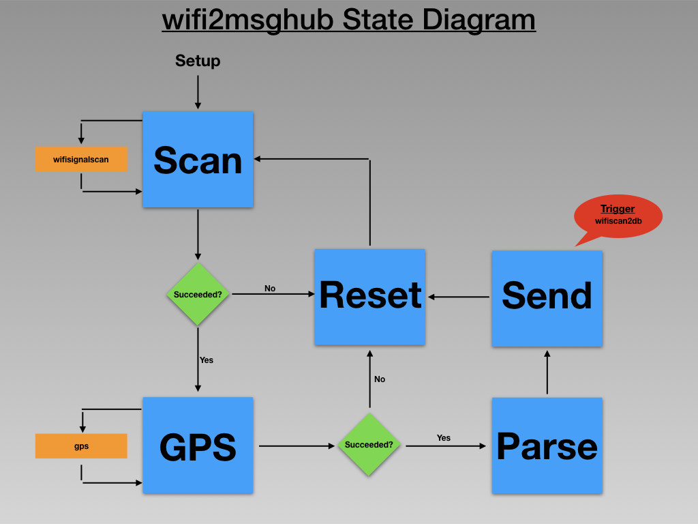

# Wifi-Signal-Strength-Mapping

The purpose of this sample project is to gather WiFi signal strength data of a given space in order to be visualized in augmented reality. This project will rely on a mobile Raspberry Pi 3B being powered by a battery, continually scanning for wifi network signal information. and the published GPS service to get the location of each scan performed. My wifimsghub sample is designed to create a Docker container that will combine two Horizon Services; one that I have written called wifisignalstrength, which will be used to determine the signal level of the found wifi networks, and the other service is called gps which will get the location of the scan performed. These containers will communicate over a local private Docker virtual network using HTTP REST APIs. Specifically, Horizon will deploy one private network for communication between wifimsghub and wifisignalstrength, and a another separate private network for wifimsghub and gps, since my top level service has declared a dependency on each of those Horizon Services. The data collected will then be formatted and sent to an Event Stream. Once the information is in an Event Stream, I will create an IBM Functions instance in the IBM Cloud that consists of an "action" function that will push the gathered data into a database, and a "trigger" that connects the action to my Event Stream topic. At this point IBM Functions will call my action function each time something is published on my topic, allowing the data to be used by the team working on the AR Signal Visualization project.

